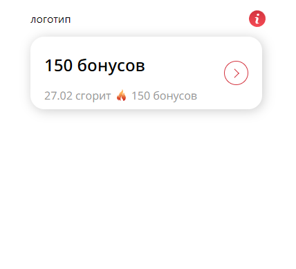

<a name="readme-top"></a>


<!-- PROJECT LOGO -->
<br />
  <a href="https://github.com/igor-tech/ProgressTerra">
    
  </a>

<!-- ABOUT THE PROJECT -->

# Bonus card
#### Test task from the company progressterra.
[](https://igor-tech.github.io/ProgressTerra)


## Stack:

- 
- 
- 
- 
- 


<!-- GETTING STARTED -->

## Getting Started

Clone the repository to run the project. Install all dependencies, run the project

### Installation

1. Get a free API Key at [https://example.com](https://example.com)
2. Clone the repo
   ```sh
   git clone https://github.com/igor-tech/ProgressTerra
   ```
3. Install NPM packages
   ```sh
   yarn install
   ```
4. Start packages
   ```sh
   yarn start
   ```

<!-- CONTACT -->

## Contact

[](https://t.me/Igor_Shargin)
[](https://www.linkedin.com/in/igorshargin/)
[](https://github.com/igor-tech)
[](https://igor-tech.github.io/ProgressTerra)


